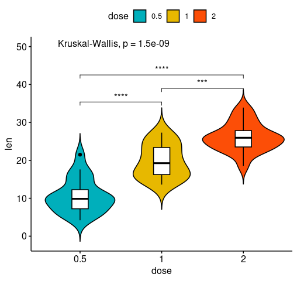
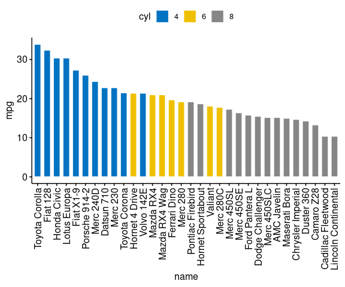
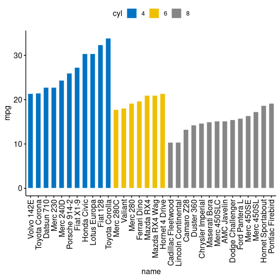
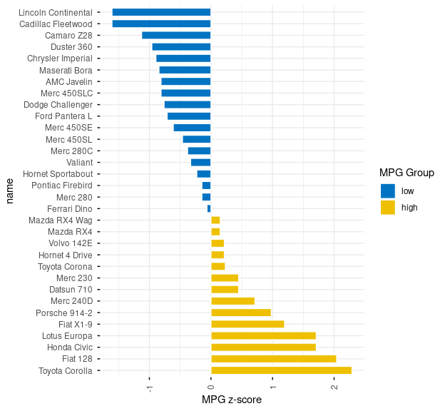
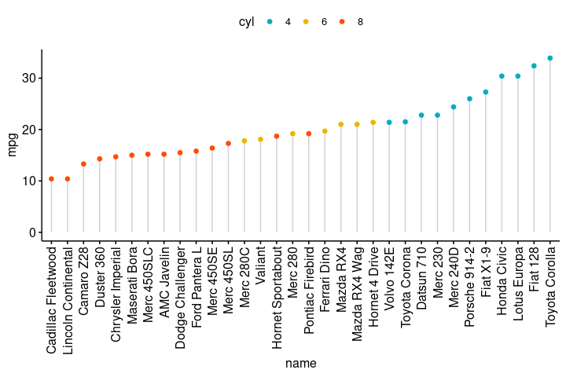
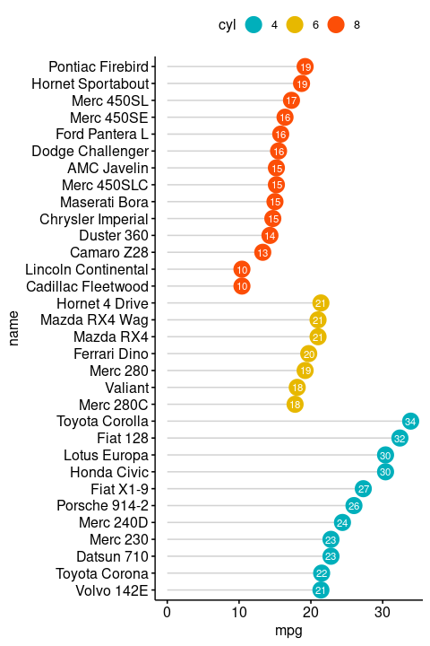
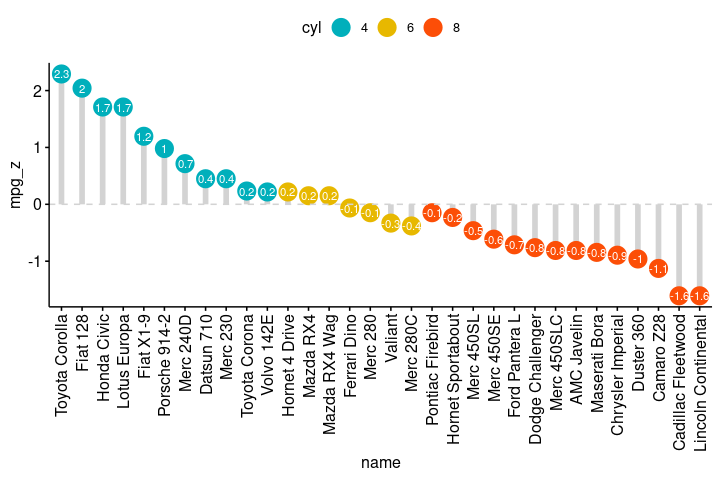
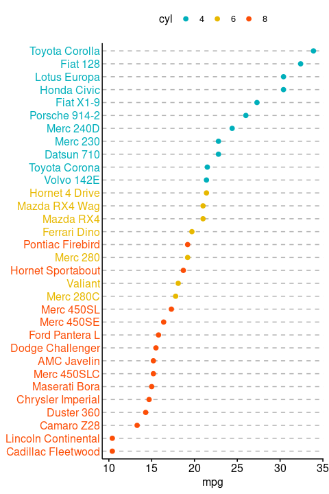

<!-- README.md is generated from README.Rmd. Please edit that file -->

[](https://travis-ci.org/kassambara/ggpubr)
[](https://cran.r-project.org/package=ggpubr)
[](https://cran.r-project.org/package=ggpubr)
[](https://cran.r-project.org/package=ggpubr)

ggpubr: ‘ggplot2’ Based Publication Ready Plots
===============================================

[ggplot2, by Hadley Wickham,](https://ggplot2.tidyverse.org/) is an
excellent and flexible package for elegant data visualization in R.
However the default generated plots requires some formatting before we
can send them for publication. Furthermore, to customize a ggplot, the
syntax is opaque and this raises the level of difficulty for researchers
with no advanced R programming skills.

The ‘ggpubr’ package provides some easy-to-use functions for creating
and customizing ‘ggplot2’- based publication ready plots.

Find out more at
<a href="https://rpkgs.datanovia.com/ggpubr/" class="uri">https://rpkgs.datanovia.com/ggpubr/</a>.

Installation and loading
------------------------

-   Install from [CRAN](https://cran.r-project.org/package=ggpubr) as
    follow:

``` r
install.packages("ggpubr")
```

-   Or, install the latest version from
    [GitHub](https://github.com/kassambara/ggpubr) as follow:

``` r
# Install
if(!require(devtools)) install.packages("devtools")
devtools::install_github("kassambara/ggpubr")
```

Distribution
------------

``` r
library(ggpubr)
#> Loading required package: ggplot2
# Create some data format
# :::::::::::::::::::::::::::::::::::::::::::::::::::
set.seed(1234)
wdata = data.frame(
   sex = factor(rep(c("F", "M"), each=200)),
   weight = c(rnorm(200, 55), rnorm(200, 58)))
head(wdata, 4)
#>   sex   weight
#> 1   F 53.79293
#> 2   F 55.27743
#> 3   F 56.08444
#> 4   F 52.65430

# Density plot with mean lines and marginal rug
# :::::::::::::::::::::::::::::::::::::::::::::::::::
# Change outline and fill colors by groups ("sex")
# Use custom palette
ggdensity(wdata, x = "weight",
   add = "mean", rug = TRUE,
   color = "sex", fill = "sex",
   palette = c("#00AFBB", "#E7B800"))
```


``` r
# Histogram plot with mean lines and marginal rug
# :::::::::::::::::::::::::::::::::::::::::::::::::::
# Change outline and fill colors by groups ("sex")
# Use custom color palette
gghistogram(wdata, x = "weight",
   add = "mean", rug = TRUE,
   color = "sex", fill = "sex",
   palette = c("#00AFBB", "#E7B800"))
```


Box plots and violin plots
--------------------------

``` r
# Load data
data("ToothGrowth")
df <- ToothGrowth
head(df, 4)
#>    len supp dose
#> 1  4.2   VC  0.5
#> 2 11.5   VC  0.5
#> 3  7.3   VC  0.5
#> 4  5.8   VC  0.5

# Box plots with jittered points
# :::::::::::::::::::::::::::::::::::::::::::::::::::
# Change outline colors by groups: dose
# Use custom color palette
# Add jitter points and change the shape by groups
 p <- ggboxplot(df, x = "dose", y = "len",
                color = "dose", palette =c("#00AFBB", "#E7B800", "#FC4E07"),
                add = "jitter", shape = "dose")
 p
```


``` r
 
 # Add p-values comparing groups
 # Specify the comparisons you want
my_comparisons <- list( c("0.5", "1"), c("1", "2"), c("0.5", "2") )
p + stat_compare_means(comparisons = my_comparisons)+ # Add pairwise comparisons p-value
  stat_compare_means(label.y = 50)                   # Add global p-value
```


``` r

 
# Violin plots with box plots inside
# :::::::::::::::::::::::::::::::::::::::::::::::::::
# Change fill color by groups: dose
# add boxplot with white fill color
ggviolin(df, x = "dose", y = "len", fill = "dose",
         palette = c("#00AFBB", "#E7B800", "#FC4E07"),
         add = "boxplot", add.params = list(fill = "white"))+
  stat_compare_means(comparisons = my_comparisons, label = "p.signif")+ # Add significance levels
  stat_compare_means(label.y = 50)                                      # Add global the p-value 
```



Bar plots
---------

### Demo data set

Load and prepare data:

``` r
# Load data
data("mtcars")
dfm <- mtcars
# Convert the cyl variable to a factor
dfm$cyl <- as.factor(dfm$cyl)
# Add the name colums
dfm$name <- rownames(dfm)
# Inspect the data
head(dfm[, c("name", "wt", "mpg", "cyl")])
#>                                name    wt  mpg cyl
#> Mazda RX4                 Mazda RX4 2.620 21.0   6
#> Mazda RX4 Wag         Mazda RX4 Wag 2.875 21.0   6
#> Datsun 710               Datsun 710 2.320 22.8   4
#> Hornet 4 Drive       Hornet 4 Drive 3.215 21.4   6
#> Hornet Sportabout Hornet Sportabout 3.440 18.7   8
#> Valiant                     Valiant 3.460 18.1   6
```

### Ordered bar plots

Change the fill color by the grouping variable “cyl”. Sorting will be
done globally, but not by groups.

``` r
ggbarplot(dfm, x = "name", y = "mpg",
          fill = "cyl",               # change fill color by cyl
          color = "white",            # Set bar border colors to white
          palette = "jco",            # jco journal color palett. see ?ggpar
          sort.val = "desc",          # Sort the value in dscending order
          sort.by.groups = FALSE,     # Don't sort inside each group
          x.text.angle = 90           # Rotate vertically x axis texts
          )
```



Sort bars inside each group. Use the argument **sort.by.groups = TRUE**.

``` r
ggbarplot(dfm, x = "name", y = "mpg",
          fill = "cyl",               # change fill color by cyl
          color = "white",            # Set bar border colors to white
          palette = "jco",            # jco journal color palett. see ?ggpar
          sort.val = "asc",           # Sort the value in dscending order
          sort.by.groups = TRUE,      # Sort inside each group
          x.text.angle = 90           # Rotate vertically x axis texts
          )
```



### Deviation graphs

The deviation graph shows the deviation of quantitatives values to a
reference value. In the R code below, we’ll plot the mpg z-score from
the mtcars dataset.

Calculate the z-score of the mpg data:

``` r
# Calculate the z-score of the mpg data
dfm$mpg_z <- (dfm$mpg -mean(dfm$mpg))/sd(dfm$mpg)
dfm$mpg_grp <- factor(ifelse(dfm$mpg_z < 0, "low", "high"), 
                     levels = c("low", "high"))
# Inspect the data
head(dfm[, c("name", "wt", "mpg", "mpg_z", "mpg_grp", "cyl")])
#>                                name    wt  mpg      mpg_z mpg_grp cyl
#> Mazda RX4                 Mazda RX4 2.620 21.0  0.1508848    high   6
#> Mazda RX4 Wag         Mazda RX4 Wag 2.875 21.0  0.1508848    high   6
#> Datsun 710               Datsun 710 2.320 22.8  0.4495434    high   4
#> Hornet 4 Drive       Hornet 4 Drive 3.215 21.4  0.2172534    high   6
#> Hornet Sportabout Hornet Sportabout 3.440 18.7 -0.2307345     low   8
#> Valiant                     Valiant 3.460 18.1 -0.3302874     low   6
```

Create an ordered barplot, colored according to the level of mpg:

``` r
ggbarplot(dfm, x = "name", y = "mpg_z",
          fill = "mpg_grp",           # change fill color by mpg_level
          color = "white",            # Set bar border colors to white
          palette = "jco",            # jco journal color palett. see ?ggpar
          sort.val = "asc",           # Sort the value in ascending order
          sort.by.groups = FALSE,     # Don't sort inside each group
          x.text.angle = 90,          # Rotate vertically x axis texts
          ylab = "MPG z-score",
          xlab = FALSE,
          legend.title = "MPG Group"
          )
```


Rotate the plot: use rotate = TRUE and sort.val = “desc”

``` r
ggbarplot(dfm, x = "name", y = "mpg_z",
          fill = "mpg_grp",           # change fill color by mpg_level
          color = "white",            # Set bar border colors to white
          palette = "jco",            # jco journal color palett. see ?ggpar
          sort.val = "desc",          # Sort the value in descending order
          sort.by.groups = FALSE,     # Don't sort inside each group
          x.text.angle = 90,          # Rotate vertically x axis texts
          ylab = "MPG z-score",
          legend.title = "MPG Group",
          rotate = TRUE,
          ggtheme = theme_minimal()
          )
```



Dot charts
----------

### Lollipop chart

Lollipop chart is an alternative to bar plots, when you have a large set
of values to visualize.

Lollipop chart colored by the grouping variable “cyl”:

``` r
ggdotchart(dfm, x = "name", y = "mpg",
           color = "cyl",                                # Color by groups
           palette = c("#00AFBB", "#E7B800", "#FC4E07"), # Custom color palette
           sorting = "ascending",                        # Sort value in descending order
           add = "segments",                             # Add segments from y = 0 to dots
           ggtheme = theme_pubr()                        # ggplot2 theme
           )
```



-   Sort in decending order. **sorting = “descending”**.
-   Rotate the plot vertically, using **rotate = TRUE**.
-   Sort the mpg value inside each group by using **group = “cyl”**.
-   Set **dot.size** to 6.
-   Add mpg values as label. **label = “mpg”** or **label =
    round(dfm$mpg)**.

``` r
ggdotchart(dfm, x = "name", y = "mpg",
           color = "cyl",                                # Color by groups
           palette = c("#00AFBB", "#E7B800", "#FC4E07"), # Custom color palette
           sorting = "descending",                       # Sort value in descending order
           add = "segments",                             # Add segments from y = 0 to dots
           rotate = TRUE,                                # Rotate vertically
           group = "cyl",                                # Order by groups
           dot.size = 6,                                 # Large dot size
           label = round(dfm$mpg),                        # Add mpg values as dot labels
           font.label = list(color = "white", size = 9, 
                             vjust = 0.5),               # Adjust label parameters
           ggtheme = theme_pubr()                        # ggplot2 theme
           )
```



Deviation graph:

-   Use y = “mpg\_z”
-   Change segment color and size: add.params = list(color =
    “lightgray”, size = 2)

``` r
ggdotchart(dfm, x = "name", y = "mpg_z",
           color = "cyl",                                # Color by groups
           palette = c("#00AFBB", "#E7B800", "#FC4E07"), # Custom color palette
           sorting = "descending",                       # Sort value in descending order
           add = "segments",                             # Add segments from y = 0 to dots
           add.params = list(color = "lightgray", size = 2), # Change segment color and size
           group = "cyl",                                # Order by groups
           dot.size = 6,                                 # Large dot size
           label = round(dfm$mpg_z,1),                        # Add mpg values as dot labels
           font.label = list(color = "white", size = 9, 
                             vjust = 0.5),               # Adjust label parameters
           ggtheme = theme_pubr()                        # ggplot2 theme
           )+
  geom_hline(yintercept = 0, linetype = 2, color = "lightgray")
```



### Cleveland’s dot plot

Color y text by groups. Use y.text.col = TRUE.

``` r
ggdotchart(dfm, x = "name", y = "mpg",
           color = "cyl",                                # Color by groups
           palette = c("#00AFBB", "#E7B800", "#FC4E07"), # Custom color palette
           sorting = "descending",                       # Sort value in descending order
           rotate = TRUE,                                # Rotate vertically
           dot.size = 2,                                 # Large dot size
           y.text.col = TRUE,                            # Color y text by groups
           ggtheme = theme_pubr()                        # ggplot2 theme
           )+
  theme_cleveland()                                      # Add dashed grids
```



More
----

Find out more at
<a href="https://rpkgs.datanovia.com/ggpubr/" class="uri">https://rpkgs.datanovia.com/ggpubr/</a>.

Blog posts
----------

-   A. Kassambara. [ggpubr R Package: ggplot2-Based Publication Ready
    Plots](http://www.sthda.com/english/articles/24-ggpubr-publication-ready-plots/)
